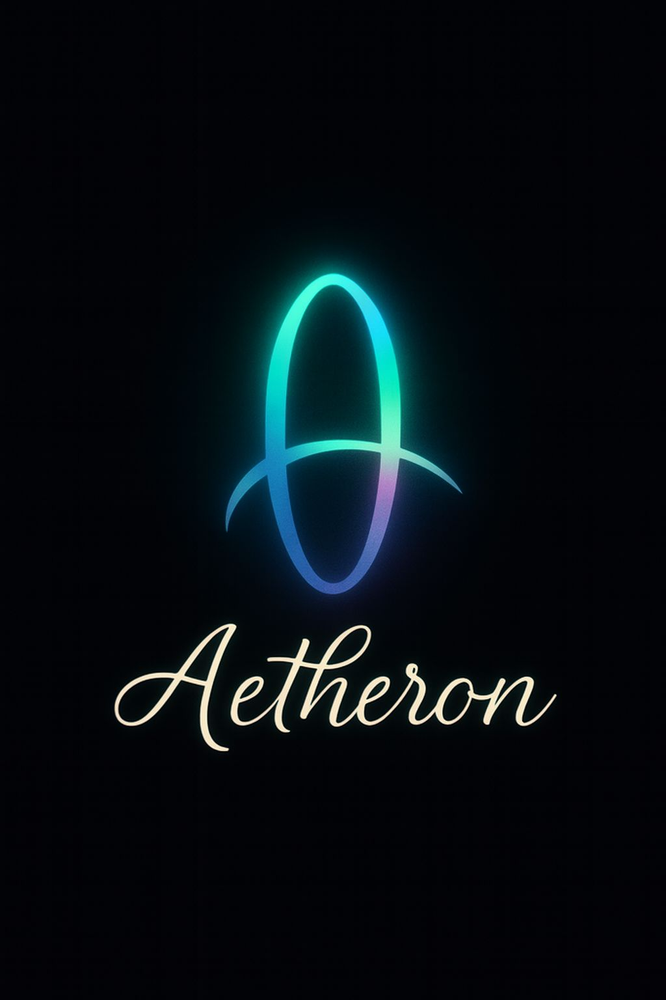

 
   Ciao! I'm Iretiola

---

🚀 **Aspiring Full-Stack Developer** | 💻 **Web Enthusiast** | 🧠 **Problem Solver**  

I’m a passionate developer who enjoys building things for the web and learning how systems work under the hood.  
I’m currently focused on **web development**, improving my **JavaScript & Python skills**, and gradually transitioning into **full-stack engineering** using **Django**.

I enjoy learning by **building projects**, breaking things (then fixing them 😅), and sharing my progress publicly.

---

## 🌱 About Me

- 🔭 Currently working on small web projects & experiments  
- 🌐 Interested in **Frontend + Backend development**
- 🧩 I enjoy debugging, logic games, and problem-solving
- 📚 Always learning — one bug at a time
- ✨ Building in public and improving consistently
- 日本語 I understand a lil' bit of Japanese 😉
---

## 🌐 Find Me Around the Web

---

## 🛠 Tech Stack

### Languages & Frameworks

---

### 🔧 Tools & Platforms

---

## 🎓 Currently Learning With

---

## 📊 GitHub Stats

Click for GitHub Stats

---

<!-- ## More Stats

 -->

---

## 🌟 Featured Projects

### 🍜 Kyvera
**Multilingual Programming Language**

- 🛠 Built with: Python
- 🎮 Focus: Experimental project
- 🚧 Status: In progress

🔗 [View Repository](https://github.com/iretiola-007/kyvera)

---

### 🧩 Bug Bounty Hunter
**Interactive game focused on finding and fixing bugs**

- 🛠 Built with: HTML, CSS, JavaScript
- 🧠 Focus: Logic, debugging, problem-solving
- 🚧 Status: Polishing & bug fixes

🔗 [View Repository](https://github.com/iretiola-007/Bug-Bounty-Hunter)

---

### 🌐 Portfolio Website
**Personal portfolio showcasing my projects and skills**

- 🛠 Built with: HTML, CSS, JavaScript
- ✨ Features: Responsive layout, clean UI
- 📌 Purpose: Frontend practice & personal branding

🔗 [View Repository](https://github.com/iretiola-007/my-portfolio)

---

✨ *Thanks for stopping by! Feel free to explore my repositories and follow my learning journey here and on my <a href="https://whatsapp.com/channel/0029VbC33ZGInlqKyZQMBY42">WhatsApp channel</a>.*

<!--  -->
 

<!--
**iretiola-007/iretiola-007** is a ✨ _special_ ✨ repository because its `README.md` (this file) appears on your GitHub profile.

Here are some ideas to get you started:

- 🔭 I’m currently working on ...
- 🌱 I’m currently learning ...
- 👯 I’m looking to collaborate on ...
- 🤔 I’m looking for help with ...
- 💬 Ask me about ...
- 📫 How to reach me: ...
- 😄 Pronouns: ...
- ⚡ Fun fact: ...
-->
